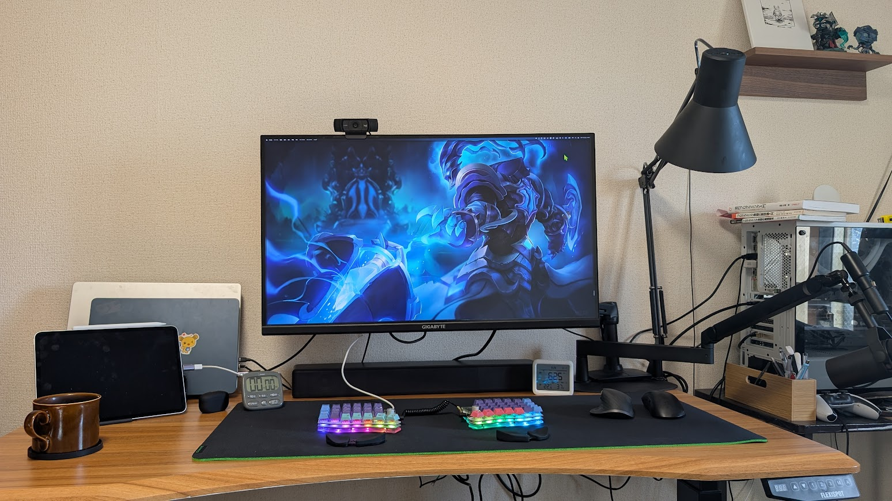
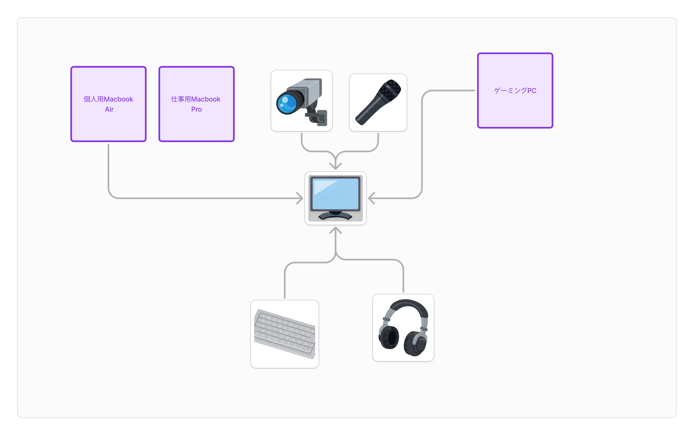
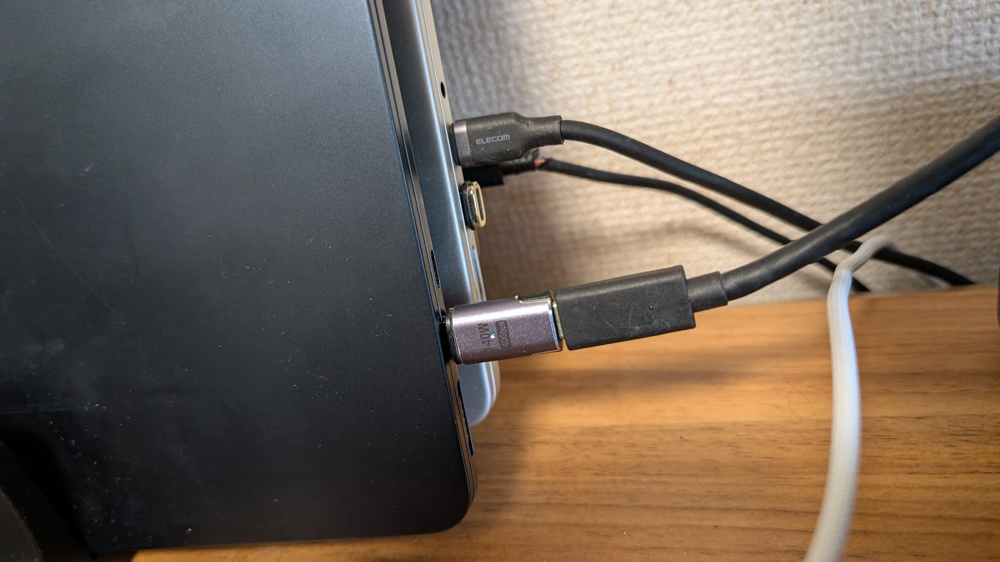
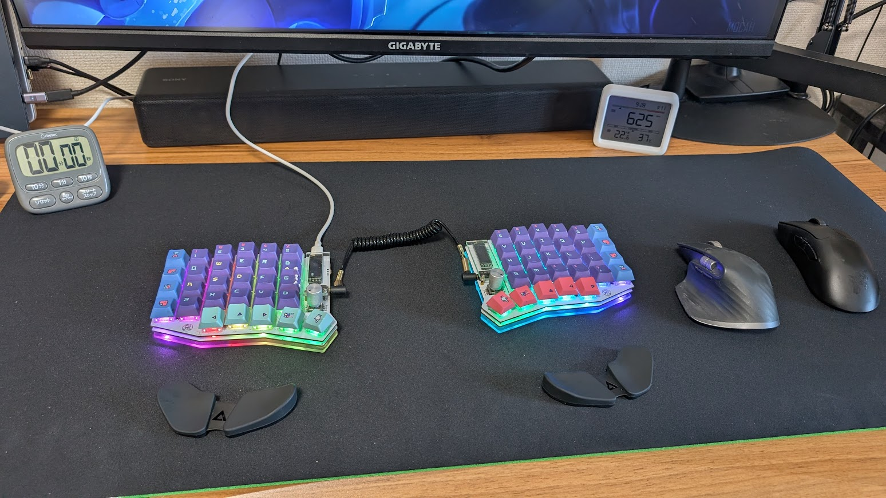

2025年の目標は作業環境の向上！ということで2025年初頭の僕のゲーム&作業環境を紹介します。

## 全体像

もっとおしゃれな感じにしたいんですが、無理っす！

## モニタを中心とした配線
モニタは4K一枚だけです。デュアルモニタも使っていたのですが、目を動かすのが疲れるのでやめました。

[GIGABYTE ゲーミングモニター 31.5インチ UHD 平面モニター 144Hz (家庭用ゲーム機 120Hz) 1ms HDR対応 M32U](https://amzn.to/3DRhYkU)

KVM機能が付いていて、ゲーミングPCと仕事用MacBook Pro, 個人用MacBook Airを切り替えて使っています。
PD給電もできるので、MacBookを充電しながら使えます。ただMacBook Proは充電の速度が足りないのでモニタとの接続とは別に充電器に繋いでます。

具体的な配線はこんな感じです。

基本的に機器は全てモニタにつなげています。Macとモニタの接続にはUSB-C、ゲーミングPCとモニタの接続にはHDMIとモニタからのUSBアップストリームポートを使っています。  
この接続でMac、ゲーミングPC共に4K 144hz HDRで使えています。ケーブルは一番高いやつ買ってください。

### PCの切り替え
MacBook間はUSB-Cケーブルを物理的に抜き差しして切り替えています。接続がマグネットになる端子を導入しているので抜き差しというより脱着です。なんか原始的ですが、個人的には切り替えやすいです。

ゲーミングPCはモニタのKVM機能を使って切り替えています。基本的にMacを使わないときは上記のUSB-Cを外しているので、電源ボタンを押すだけでモニタに接続している機器がゲーミングPCで使えるようになります。

### 接続している機器
Webカメラは[Logicool C920](https://amzn.to/3CgNDvw)です。特に可もなく不可もなくです。  
マイクは[SHURE SM7B](https://amzn.to/3DRyQrI)です。MVX2Uデジタルオーディオインターフェースを使ってモニタとUSBで接続しています。正直音質があがったのかはよくわかりませんが、見た目がかっこいいので満足しています。  
マイクアームは[Elgato Wave Mic Arm LP](https://amzn.to/3WgmLmd)です。下からでてると左右が動かしやすいので気に入ってます。  
スピーカーは[Sony HT-S200F](https://amzn.to/4ahS8CH)です。MacともWindowsともBluetooth接続できるスピーカーとして便利です。

## 手元

キーボードはSofle Keyboard v2です。自分で組んだのではなく、メルカリで組み立て済みのものを購入しました。キースイッチはCherry MX2Aの静音赤軸です。
一回接続が悪くなったのではんだごてで修理した時、キーキャップを外さずに作業したらキーキャップが溶けました...。

Mac用のマウスはLogicool MX Master 3です。スクロールが便利だと作業が捗ります。トラックボールも試したのですが、自分には合わなかったです。  

ゲーミングPC用のマウスは[Razer DeathAdder V3 Pro](https://amzn.to/4fNgRA0)です。選定理由はFaker。  
DeathAdderは初代から使っていて、どんどん軽くなっているのを感じます。サイズは大きめのままなので手が大きくて被せ持ちする僕にはドンピシャです。

デスクマットは[Razer Gigantus V2 – XXL](https://amzn.to/4fOzFyJ)です。マウスの滑りが完璧です。後述の可動式パームレストを導入したのでキーボードとマウス全面を覆えるサイズを選びました。

パームレストは[Carpio 2.0](https://amzn.to/3WeLYgN)です。可動式でマウスでもキーボードでも使えるので便利です。サイズも小さくて邪魔になりませんし、見た目もいい感じです。  
昨年から手首が痛くなってきたので導入しました。一ヶ月ほど使ってみて痛みが和らいだので効果はあると思います。 
参考情報ですが、かなり身体的に大きい方の僕でもLサイズはやや大きいかな？という感じがします。購入する人は思考停止でLサイズを選ばないようにしましょう。

その他、ポモドーロ用のキッチンタイマーと二酸化炭素計測器も置いてます。
[SwitchBot CO2センサー](https://amzn.to/4049YEs)が安くて湿度と温度も測れるのでおすすめです。

## 改善したい点
- オーディオ
    - 今ヘッドホンをモニタのイヤホンジャックに直挿しなので、なんかもっといい感じのオーディオ環境にしたいです。自分の環境でMacでもゲーミングPCでもいい感じに使えるヘッドホンアンプみたいなのないかな？
- モニタ
    - 有機EL、240hzのモニタにしたいです。[ROG Swift OLED PG32UCDP](https://rog.asus.com/jp/monitors/27-to-31-5-inches/rog-swift-oled-pg32ucdp)が良さそう。
    - 一度有機ELのモニタ買ったんですがPD給電ができなかったのでメルカリで即売りました...
    

    
