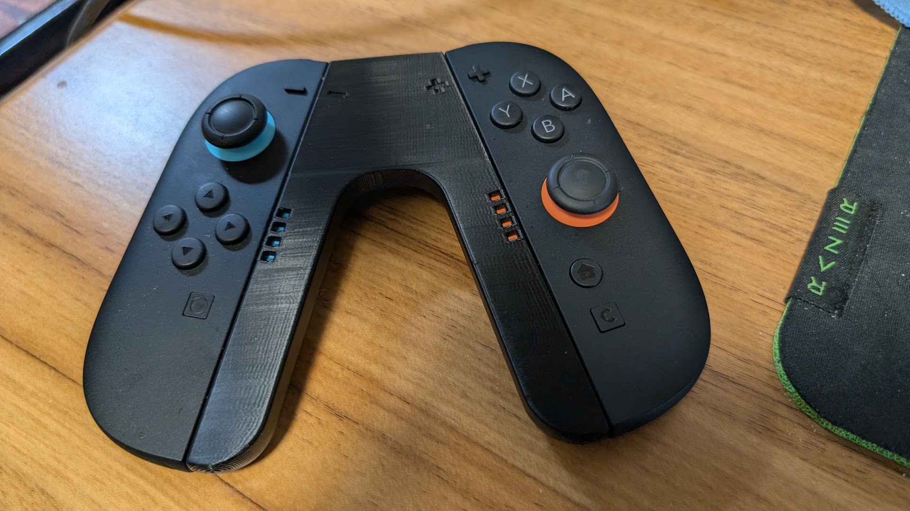
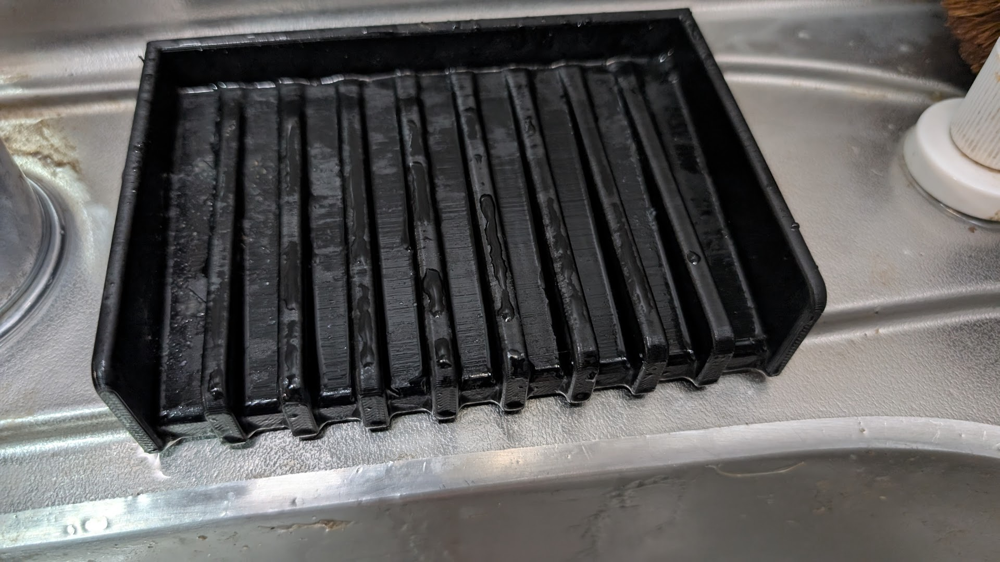

3Dプリンタを買ってから一ヶ月が経ちました。購入したのはBambu Lab P2Sというやつです。
[Bambu Lab P2S | Bambu Lab ストア](https://jp.store.bambulab.com/products/p2s?gad_source=1&gad_campaignid=23131790869&gbraid=0AAAAA9n4HT2WSxy75tFbIeYpqN3nd0uiy&gclid=Cj0KCQiAr5nKBhCpARIsACa_NiOVGW5FiG_Qg7vVRQXWHIuWKOkArokS_D-DG4pQbJeRyg5ZDPe_gpIaApCyEALw_wcB)

3Dプリンタを探していたらちょうど発売されるこのプリンタを発見したので購入しました。  
思ったより音は小さいし、複数のフィラメント自動で切り分けてくれるし便利です。たまにスパゲティ状態になるんですが、カメラで自動で感知して印刷をstopしてくれるのも便利。

## 既成モデルでつくったもの
### スイッチ2 joy-conのグリップ
[Nintendo Switch 2 Joy-Con 2用スナップロックグリップ 作成者： Manabun Lab](https://makerworld.com/ja/models/1514088-nintendo-switch-2-joy-con-2-snap-lock-grip#profileId-1586658)

既成のモデルをそのまま印刷したやつです。ハの字になっただけで手首の角度が自然になり操作しやすくなりました。
ボタンポチで既存のモデルが印刷できる便利さを体感。楽しすぎて3Dプリンタ購入してからの一週間はずっとMakerWorldを漁っていました。

### スポンジ置き
[スポンジ／石鹸ホルダー - キッチン／バスルーム 作成者： 3dprintconst](https://makerworld.com/ja/models/1217728-sponge-soap-holder-kitchen-bathroom#profileId-1233935)

スポンジ置きです。水が掃けるように傾斜と溝がついています。既存のモデルではサイズが我が家のシンクに合わなかったのでスライサーで調整して印刷しました。  
既存の製品だと微妙に我が家に合わない製品ばっかり...ということになりがちですが、3Dプリンタなら自分で調整して印刷できます。  
シンクにスポンジを置くポジションが無く洗い物のたびにスポンジがシンクに滑り落ちていたので、このホルダーを導入してかなり便利になりました。

### コントローラースタンド
[PS5コントローラー用スタンド+(DualSenseEdge) 作成者： Printynator](https://makerworld.com/ja/models/1093970-ps5-standard-controller-stand-dualsense-edge#profileId-1088010)

「QWYNG」を刻印してコントローラースタンドも印刷しました。こういうのができるのも3Dプリンタのいいところ。  
机の上に自分の名前が刻印された製品があると自分の居場所感が増していい感じです。

## 自作モデル
### iPadスタンド
ここからは自分が作ったモデルです。  
市販の磁石でくっつくtype c端子と組み合わせて、置くだけで充電できるiPadスタンドを作成しました。



アイデアの源泉はこの[製品](https://gome.base.shop/items/124105220)。自分の家にあった端子に合わせてモデルを作成しました。  
以前からiPadの充電には課題感を持っていました。本体側が挿入される側のせいで、手に持っているのは本体なのに、力をいれないといけないのは挿入する充電端子という矛盾が面倒。スマホなら軽いのであまり気になりませんが、iPadは重量もあるのでそのへんが気になります。充電が面倒な割にたまにしか使わないので、いざ必要になった時に充電がないことが多い。    
簡単に置けて充電もできるiPadスタンドがないかな〜と考えて作成しました。    
磁石でつけ外ししているのでiPadといっしょにスタンドが持ち上がらないようにスタンドを机に固定する必要があります。今は外付けのクランプで固定していますが、いずれクランプ付きのスタンドを作成したい。  

### デッキケース
筆者はトレーディングカードゲームが趣味でよく遊びます。カードゲームではライフの管理を行う必要があり、競技的な大会だと紙でメモをする必要があったりします。  
たいていのデッキケースにはカードとサイコロは入れられるんですが、メモとペンは入りません。これだと大会にでるのにデッキケースとライフメモとペンをそれぞれバックから取り出す必要があり、非常に面倒です。  
そこで、ライフメモとペンが入るデッキケースを作成しました。

そもそもモデリングソフトで複数部品のあるモデルを作成すること自体が難しく、10回くらい試作を重ねました。  
最初はヒンジをつけて蓋と一体型にしようとしましたが、ヒンジをモデリングするのが面倒すぎて挫折。マグネットを活用する形にしました。  
ペンはその辺のコンビニで買ったボールペンでも使えるように蓋に穴をあけてます。実用性重視。  
実際に使用し、カバンの中で散らばったりすることもなく問題なく使用できました。  
今後の改良点として、持ちやすいように表面に装飾を彫ったり、もう少しスリムにしたいと思っています。  

## 実際に3Dプリンタを使って初めて気付いたこと
- フィラメント（原料のプラスチック）を切り替える際にゴミが出る。このゴミはプリンタの後ろに排出されるのでプリンタの後ろがプラスチックのゴミであふれる。
  - ゴミを散らかさないようにする[poop chute](https://makerworld.com/ja/search/models?keyword=tag:%20poop)という機構が定番になっている。
- PLA（プラスチックの種類）の場合、厚みは2mm以上にしないとヤワすぎて壊れる。
- 印刷の向きで強度が変わる。レイヤを重ねて印刷する関係上、水平方向の力に弱く、垂直には強い。
- 試行錯誤しているとフィラメントがあっという間に減る。一ヶ月で4kgほど使った。
- フィラメントの色は重要。満足感への影響大。