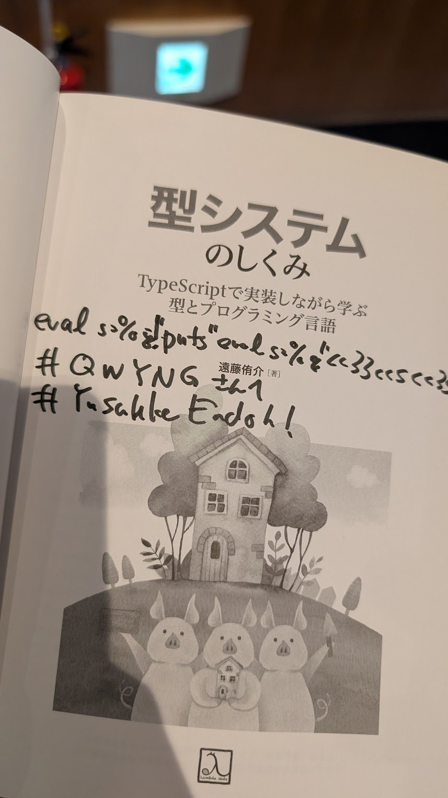

RubyKaigi 2025に参加してきたので感想を書きます！


## 目的
今回の目的は、最近OSSへのPRで@ioquatix(Samuel Williams)氏と@tompng氏に丁寧なレビューもらったことへのお礼でした！無事達成！これからもちょこちょこPRだしていくぞ！  
(写真もとったけど許可とってないので載せない）


## 本屋さん
今回のRubyKaigiは本屋さんが出店していました。発表を聞いて盛り上がった気持ちのまま本が買える最高の体験でした。
- [型システムのしくみ](https://www.lambdanote.com/products/type-systems)
- [ 計算機科学指向のプログラミング入門 — 離陸ファース トで Ruby と C を学ぶ — | 久野 靖 |本 | 通販 | Amazon](https://amzn.to/3GdQ83o)

上記二冊を買いました。特に後者はRubyKaigiをみて「うおお！俺もCをちゃんと読めるようにするぞ！」という気持ちがないと買わなかったかもしれません。RubyKaigi最高。  
また、(おそらく)Ruby wasmで公開されている[RubyKaigi Warrior](https://rubykaigi-warrior.fly.dev)というゲームをクリアして[Layered Design for Ruby on Rails Applications](https://amzn.to/441GD1m)の著者サイン入り本をもらいました。風来のシレンをプログラミングで解くような面白いゲームでした。`Array#sample`でクリアしてしまいやや罪悪感が残っています。([ネタバレ注意の回答gist](https://x.com/qwyngg/status/1913074014186279295))  
[sasadaさんに写真取ってもらえて](https://x.com/_ko1/status/1913071404846833674)嬉しかったです。

型システムのしくみもサインをもらいました。

QWYNGが書いてあるQuineを書いてもらえてハッピー。嬉しくて絶対に実行したかったので、「これってなんの文字ですか？」とmameさんに聞きにいってしまいました。

```ruby
eval s=%q!puts"eval s=%q"<<33<<s<<33
# QWYNGさんへ
# Yusuke Endoh!
```

## RubyKaigiのススメ
最後に、RubyKaigiに興味がある方に参加をオススメしておきます！  
RubyKaigiは「Rubyをこうしたい」という発表が多いです。毎日自分が使っている道具が誰かの物語があって作られていることがわかる場所です。人間は物語が好きなので、物語がある道具には愛着が湧きます。愛着がある道具は詳しくなります。
RubyKaigiは色々な方向で色々な人がRubyのことを考えていて、Rubyに愛着が持ちやすい場所です。皆さん参加を検討してみてください。（もちろん登壇も）

----

以下会場で取っていた発表のメモです。しっかり調べた内容ではないので間違っている内容があるかもしれません。  
発表の内容を日本語にしようとすると真剣に聞けるんですよね。発表を聞いてる最中にツイートしているのもそれが目的です。

## keynote
文字コードの話。文字の伝達手段の成り立ちから説明されていて歴史みがある。
- 文字コードによってバイナリへのマッピングが違うこと
- 文字コードは乱立し、世界は混乱を極めた
- Unicodeが出てきたよ。世界中の文字を含めたいという思想で形式的でパフォーマンスが良かった
- Unicodeが文字集合の特定文字を示すコードポイント、UTF8が実際にどう達成するか
- ENCIDCと日本語の歴史。Shift-ってここからきてるんですね。表示ｓれないけど、いこのバイト列はマルチバイトだよってそんな技術あったんだ。
- 文字コードに感謝！マルチバイト入力最高！
- 家族絵文字、:de:
- 見た目の文字数と実際のコードポイント数は異なることがある。
- それをまとめるのが書記素クラスタ
- コードポイントではなく書記素クラスタをもとにするパッチをRelineに入れた
- Unicodeの更新
- 年一で更新されるんだ
- インド系文字のためのプロパティを書記素クラスタでいい感じにするためのあれがparseできなかった。
- parserを直した
- テストが落ちた。書記素クラスタ単位にはならなかった、onigmoが対応していなかった。
- Unicode15.1.0対応！そして16へ


## Bringing Linux pidfd to Ruby
- pidfd というlinux5.3から導入された新しいプロセスマネジメントソフトウェアをRubyに導入する話
- GVLがあるからIOヘビーな処理は良いけどCPUヘボーな処理はきついよ
- io-bound mythでも話されてたけど隠されてるCPUをつかった行動は行ってるよ
- karafkaとsyouryukenにCPUフレンドな並列処理をいれたい。
- Ractors、forkがある
- Ractorはまだ重い
- よしforkだ
- 最初にforkを試した。PIDを使ってプロセスをマネジメント
- 開発環境では動いてレビューにだした。PidfdsがプロフェッショナルなAPIだよ！と教えてもらった
- PIDはただの数字なので、例えば数字にkill(id)しても無駄なことが多いよね。（レースコンディションの一つ）
- PIDはコネクションプールみたいに再利用されるからハイジャックされることもありえるよ
- シグナルもレースコンディションがあるよ
	- シグナルレースはpidfdsでも解決されないらしい
- PIDベースのマネジメントが多いよ
- pidfdはプロセスファイルディスクリプタを扱って管理するよ
- ただの数字ではないので参照が安定している。しかもselectやらepollやらpollingも可能。シグナルレースコンディションもない
- 二つのファイルディスクリプタのようなAPIが使える
- FFIをつかって、COREを変えることなく使えるようにした
- syscallって全部マジックナンバーついてるんすね〜
- よりプロセスの生存確認や、シグナル送信、等PIDっぽいPAIも実装した。
- orphanプロセスを消したり、できる
- linux5.3 < macosとかwindosではつかえない。同じPIDネームスペース内でしか使えない
- pidfd overkill ww
- 自分が操作できない環境とか、自分と関係ないプロセスあつかったりとかそういうところで使うのがいいかもね。
- プロセスマネジメントは思ったより大変！

## A side gig for RuboCop, the Bookworm code crawler
- Chefs -> MetaではRubyが使われてるよ
- 災害を避けるには人を災害から遠ざけるのも効果的
- foo = TrueはPythonやでというcop
- Rubocopは大規模なリファクタリングとしても使える
- AST単位でreplaceするのは効率がいいよ
- cookbookの参照切れとかsafe deleteが心配
- ymlも見てほしい
- 依存ツリーとう複雑。どのレシピがホストで走るのが断定がむずい
- Bookworm
- ないレシピやデッドコード、leafのレシピがわあかる
- chefに合わせて、メタデータをクロールする
- 対話式のデバック体験を目指したCLIを構築
- 車輪の再発明をせず、ほぼrubocopのASTマッチング
- chefのDSLを解析してメタデータを集めてるっぽい
- 昼休みに読めるくらいコードが少ない <1K LOC
- https://github.com/facebook/bookworm

## SDB: Efficient Ruby Stack Scanning Without the GVL
- GVLをバイパスしたスタックプロファイラ
- スレッドといっしょに治す
- RubyVmはstackプロファイラが読んでいる間も更新する。
- Atomicにするなにかが話されたがよくわからんかった
- GVLを利用したプロファイラと比べるとCPUリソースをクワない
## Parsing and generating SQLite's SQL dialect with Ruby
- https://github.com/fractaledmind/plume
- rustベースのパーサーはサポートしてない構文がある。よって2しか使われていない
- 互換性が鍵
- コンピューターサイエンスの学位はないけど挑戦したい。かっこいい
- アーロンパターソンのパーサーの規則を守っている
  - Rubyで書く
  - integerとかallocationが少ない値を使う
  - tokenをそのまま使う
  - 名前の値をスパンの場所を保存しておくだけにしてlazyにしている
- コントリビューションまってるよ

## Performance Bugs and Low-level Ruby Observability APIs
- Low−level VMに近い普段無視している詳細
- Ruby関係なくいろんな要因で遅くなるよね
- debug.h、thread.hに色々プロファイルするAPIがある
- Cを書かないといけないよね。
- それぞれRubyコードで簡単につかえるようにしたGemを用意した。内部のAPIを紹介するよ
- オブジェクト生成の調査
  - 作成するオブジェクトを全部RubyのArrayにいれて確認できる
  - これにはTracepoiintAPIをつかってオブジェクトの生成にフックしてArrayに値を突っ込むCコードを入れている
  - 作成したオブジェクトがGCされないで確認できる
  - オブジェクトはイニシャライズ時には空
  - 内部の隠されしオブジェクトとは
  - キャッシュ、メソッド情報、モジュール
- GCの調査
  - これもTracepoint APIをつかって記録
- Postponed job
  - tracepointはパフォーマンスにインパクトがあるが
  - safepointという颯空をしても問題ない場所があるGVLに引っかからない特に使える
  - Rubyに暇なときにこのメソッド使ってよというようなもの
  - 32個までしか登録できない1個はruby
  - Safepointは関係ないメソッドの途中かもしれない
- frame profiling api
  - よく使われているやつ
  - 効率がいいらしい
- debug inspectore
  - より協力でローカルの変数を参照できす
  - すでにGemがある
- GVLの情報がわかるAPI
  - GVL-traceing gemの紹介
  - threadsがGVLによってwaitしているとかreadyなのかとかみれるよ
  - これもtoolkitに実装してある
- 組み合わせて新しいプロファイラをつくろう
  - GVLがアプリケーションをいつリリースしているか
  - すごい色々でつくっている107行らしい
- performance
  - バグかどうかはインパクト次第。そのためのプロファイラ
  - 新しいプロファイラを待っている
	- 自分たちのプロダクトの問題は自分たちでプロファイラを作らないと判断できんな！(?)

## Dissecting and Reconstructing Ruby Syntactic Structures
- おなじみBNFで構文を定義しているよ
- parase.yとはLramaに食わせてパースを生み出す設計図
- 他の言語と比べて非終端記号が多い
- 非終端記号が他の言語に比べて多いの面白いな。それだけ終端記号の配置の仕方がたくさんあるってことかな
- statementとexplessionが多いわけではない。rubyはそこにargとptimaryがある
- argはなんでいる？
  - expのサブセット
  - f x + y をf(x + y)なのかf(x) + yなのかわからない
  - puts 1, 1 これもカンマ続きargというルールが荒いらしい
- primary
  - thenがresuceなのかifなのかみたいなところを判定する
  - ちょっとここ聞き取れん勝った
- lrama
  - 書き換え規則そのものを抽象的に表現できる
  - Parameterizing ruleaをつくってこの複雑性を抽象化した
  - 実際につかってみて気づかなかったなにかに気づいた
  - よりparse.yを抽象化したい
	  - prismにも対応したい
## Keeping Secrets: Lessons Learned From Securing GitHub
- Githubの脆弱性を見つけた話
- GitHubは巨大なMVCでつくられたモノリス
- ViewConponent使っている
- ユーザーから渡される値をsendしていた！
- 引数はないので引き数は渡せない
- 引数なしでできることは？
- ファイルネームやクラス名、メソッド名
- メソッド名を集める。
- メソッドのなあにenvを返すメソッドがあった
- 暗号の鍵もあったので、エンタープライズサーバーでリモートコード実行も可能だった
- どうやってまもるか
- 修復
  - とりあえずsendはやめた
  - public_sendもあるけど危ないことには関係ない
  - 直接sendにわたすのではなく。ちゃんとこっちで指定しよう
  - グローバルなENVをそのまま渡すのをやめた
- brakemaんとかrubocopとかスキャニングツールは色々あるよ
- ユーザーから渡される値は信用せず、Validateしよう！
- Rubyで値を秘匿するには
- コードとシークレットわけたり、シークレットのrotationをいれたり
- ENVに秘匿したい値をいれない
## Demystifying Ruby Debuggers: A Deep Dive into Internals
- デバッガとその使い方の話
- わかりづらいバグがあるよね（真偽値とか引数の扱いとか)
- deguhは34％にしか使われてなかった
- ByeBugはtracepointをつかってなんかしてる
- Debug.gemはtracepointが必要なイベントだけ指定できるようになったので、それを利用している。のでByeBugよりパフォーマンスが良いらしい
- RubyMine Debugger
  - rubyのversion関係なくパフォーマンスのデグレがない
  - debase.gem（バックエンド）とruby-debug-idegem（フロント）で動いている
  - これらは3.0 or < 3.0で別れた実装がある
  - RubyMineのデバッガの説明がある

## Bazel for Ruby
- Googleが開発しているビルド+テストツール
- gemをビルドして、docker imageつくって、テストしてで依存関係が大変
- bazelでrubyのrulesがある
- rubyやらbundler通した依存関係や、テストやgemのpushもしてくれる
- libの中にビルド設定ファイルいれたりで結構面倒そう
- 世の中のCI/CD環境くれるくんのプラグイン的なものでいいのでは..
  - ローカルマシンでできるのが強みではありそう
## Toward Ractor local GC
- RactorのGCパフォーマンスが悪い
- 共有可能なオブジェクトがあるから並列でGCさせるのがむずい
- せや、共有可能なオブジェクトとRactor固有のオブジェクトのGCを分けよう！
- Racror::Portというメールボックスっぽい概念のプロポーザルがでている
  - yieldよりメールボックスの概念のほうが直感的な人おおそうではある
- 基本的にobjは一つのRactorしか持たず、他のRactorから参照できない
- 共有可能なオブジェクト
  - class module
  - immutable obj
  - sp obj
- 他のRactorから共有可能なオブジェクトをRactor単位でGCしたらヌルポするよね
- 参照を保存しておくのはむずい。それぞれ参照は常に更新できるし、パフォーマンスのーバーヘッドも大きそう
- 今は共有可能なオブジェクトは共通のヒープに入れている
  - これをGCするには全部のRactorとめないといけない
- Erlangはlocal GCしててすごい。
- 共有可能objは常に生きているとしてGCしない
- GlobalGC（頻繁にやらない）でだけ共有可能objをGCする
- Global GCの頻度を減らしたりってできるのだろうか
- Ruby2025ででるらしい
- 共有可能オブジェクトの参照全部管理ができるアルゴリズムあるのすげぇよ..


## Analyzing Ruby Code in IRB
- https://drive.google.com/file/d/1BMGGH-V-8Wj2m9VoJVcAAXbg3jn9azG4/view
- シンタックスとかプロンプトが変わるよ
- ;つけたらstatsmentみたいにできるんだ
- Rippperでパースしてさらにirbでパースしていた
- これがprismになると
- prismは151のnodeの種類がある
- tokenは種類数、構造はヒアドキュメントとかで大変
- tokenとtokenを更に更新している
- 入れ子はRipperでtokenしてさらにirbでパースしていた
- 演算子の順序とか考慮できにあのでエッジケースがある
- Prismにはtraversが簡単になるVisitoというAPIがある
- Prismだとparseしたsyntaxの結果をチェックできる
- evalの中身判定するため、BEGIN { thorow :valid; true } の中にコードをいれている。
  - BEGIN { thorow :valid; true }でevalの引数が判定できるっていうのよくわからんな
- AutoComはPrismCallNodeみたいなやつのなかだったら型判定してメソッドだしている
- arrayの中身の要素の型を遅延評価していたりするっぽい
## On-the-fly Suggestions of Rewriting Method Deprecations
- deprecationをライブラリ作者が変換を実装し、ユーザーはパッチを簡単に受け取ることができるGemの紹介
- 移行のために、２つのメソッドが課題なことが多い
- ドキュメンテーションで、説明
- Kernel.warnだすとか
- 静的解析とか
- waringをruntimeで集めて解消するRubocopを書く記事が参考になった
- 他の言語でautofixがあった
- SmarlTolkを下にした言語の機能に今回のGemと同じような機能があった
- 自動で書き換える以外にもログだしたりの機能が最初からあるの、ユースケースベースという感じだ
- 201xのgemがちゃんとprismに対応した開発されてるのすごいなぁ
- メソッドフックするやつね、prependとか使いがち
- define_method多重になると結構奥の大変なのだけ心配。そんな大変じゃないかもしれない
- 非推奨のメソッドってsendとかで動いてることが多いから、そこらへんもパッチできたらうれC

