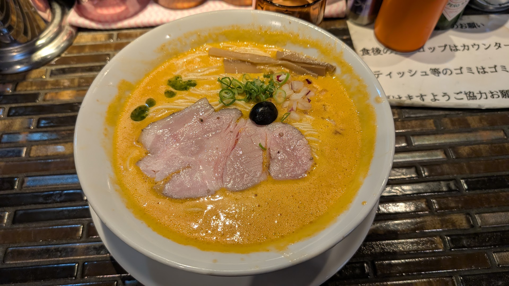
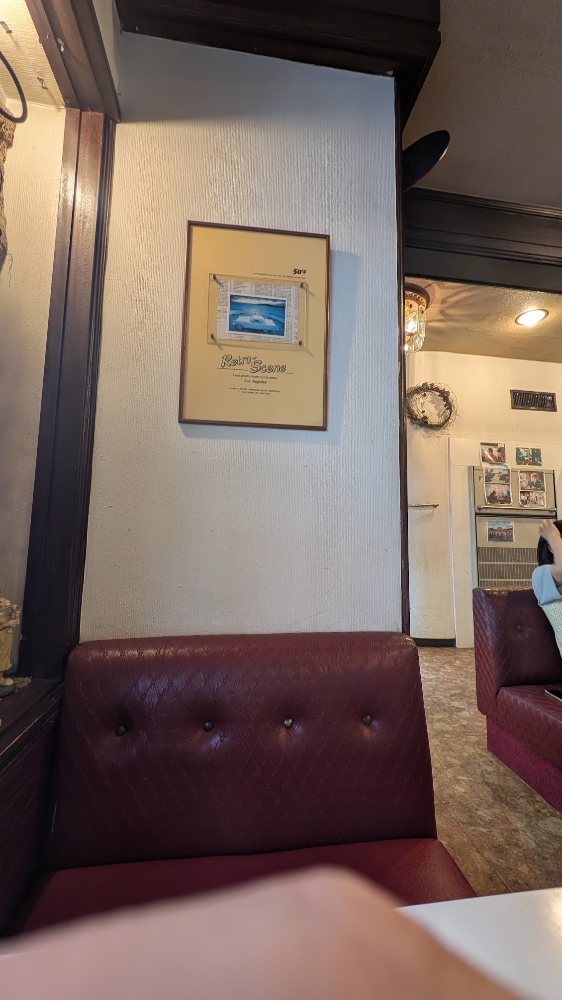
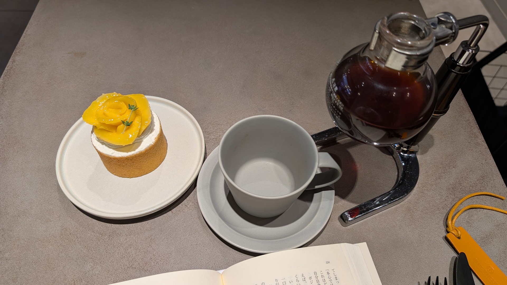
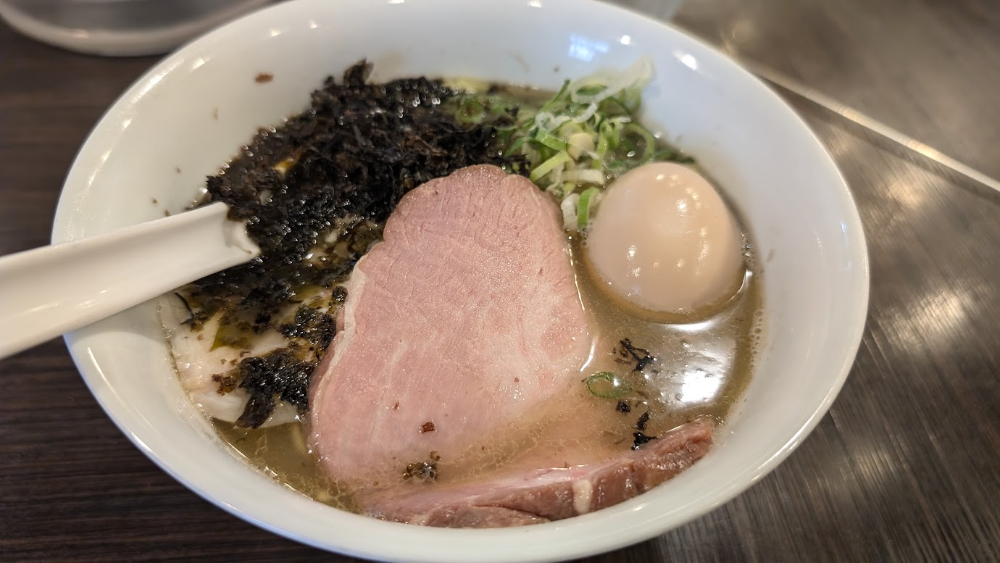
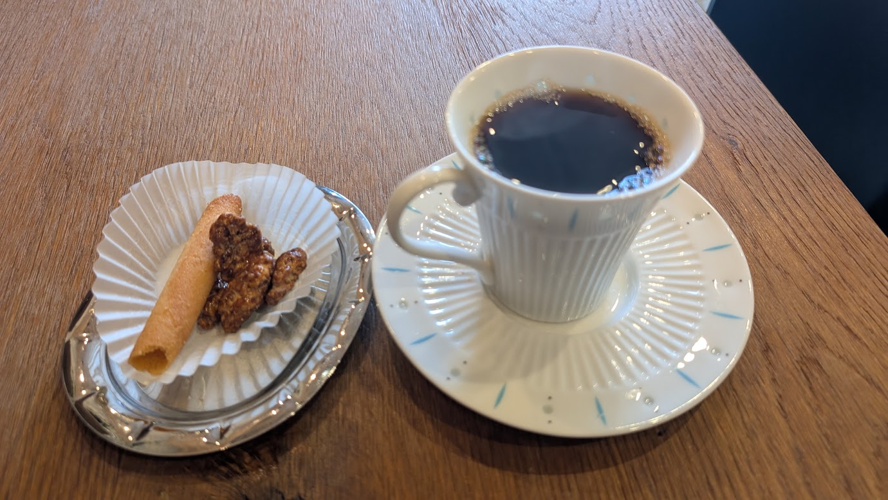

前回[新丸子の三種の神器](/posts/20230715/)を紹介した。今回はそのpart2である。

## ヌードルズキッチン ガナーズ
https://x.com/GUNNERS_754

ブレンダーでクリーミーにしたスープが特徴のラーメン店。とにかくスープが美味い。見た目はどろっとこってりしてそうだが、実際にはあっさり系のスープでいくらでも飲めるやつである。  
そのスープが細麺と相性が良く、嫌な感じがなくスルッと行けるラーメン。  
ちょうどいい量のラーメンをちょうどよく食べられる。二郎系や家系と違って万人に好まれる系で老若男女問わずおすすめである。

## 喫茶 まりも

絵に描いたようなレトロな喫茶店。店の前で噴水がチャカポコしてて良い。店内のBGMもレトロそうな洋楽が流れていていい。  
ちょうどいい感じで客がガヤガヤ騒いでおり、良い感じに騒いでいるところだと集中できるタイプの人にはもってこい。  
僕も本を片手に入ったがかなり捗った。やっぱり人がガヤガヤしているところは集中できる。  
ワンドリンク2時間制でWi-Fiや充電はない。

## MYSTAR BASE
https://mystarbase.jp/

「喫茶 まりも」とは打って変わってモダンな感じのバームクーヘンとコーヒーを出してくれるお店。  
バームクーヘンの口溶けがめちゃめちゃよく、サイフォンで淹れてもらった酸味強めのコーヒーとベストマッチであった。  
写真を撮った日は土曜の午前中だったので空いていたが、よく混雑しているのをみかける。ただ行列ができているほどではないのが新丸子の良いところである。  
混雑時は1時間制。

## 麺や でこ
https://x.com/my_deco1

煮干しがガッツリ効いたラーメン。煮干しが苦手な人は苦手だと思う。僕は煮干しが好きなので結構好き。  
具のチャーシューが肉厚で煮干しに負けないようになっているのが好き。おそらく低温調理であろう鶏ハムも乗っていてこれも煮干しスープと合う。

## 豆こねくと
https://www.mame-connect.com/

コスタリカのコーヒー豆専門店らしい。豆を購入するとサービスコーヒーとお菓子がいただけるすごいお店。
注文を受けてから焙煎してくれているようで、その待ち時間にコーヒーを提供してもらっている格好。  
豆の種類とか味もわかりやすく表記してもらっておりとても選びやすい。また店員さんも非常に親切でおすすめを聞くと快く答えてくれる。  
目の前が小学校で、たまに運動会的なイベントをやっておりそれを見ながらコーヒーを飲むのは平和が感じられて良い。

2026年9月現在、金土日しかやっていないがお休みの日に豆を買うついでに一息つける場所としてとてもいいお店。ただ、読書で2時間過ごすようなお店ではない。

## ラップアップ
新丸子とかいう神の土地。いい店が多すぎる。人類全員新丸子に住んだほうが良い。
とはいえ武蔵小杉駅の南側もいいお店は沢山あるのでまた紹介ブログを書きたい。

